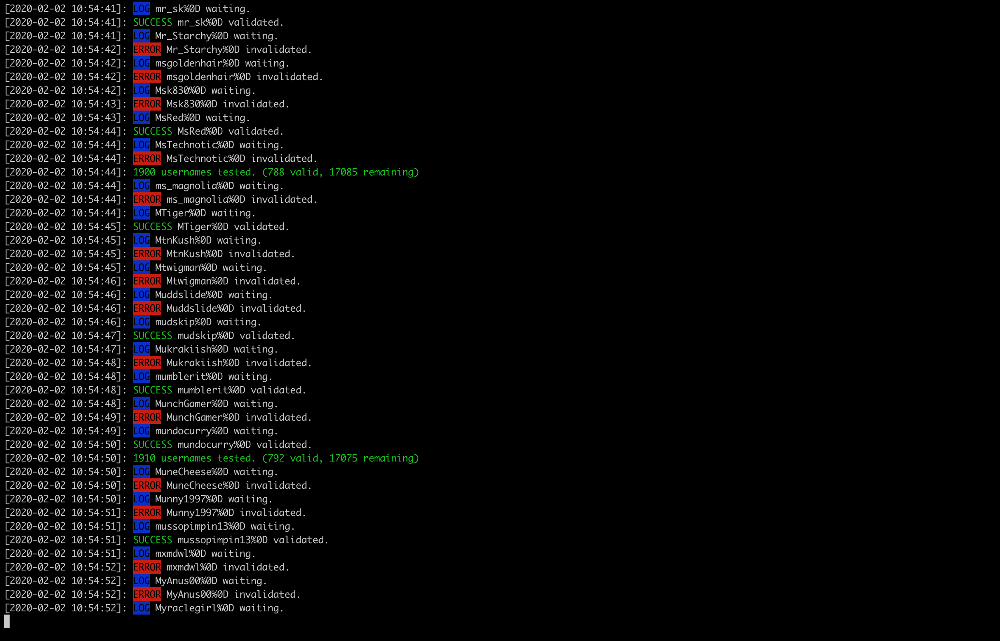

# Steam Usernames Scraper

Scrape Steam usernames to check if there are valid!

* Automatically abort requests if they exceed one second
* No proxy needed
* Illimited number of usernames
* As fast as possible (around 3 calls per second)

## Installation

* Install dependencies (`npm install`)
* Create a `list.txt` file with your usernames (with a line break between each)
* Create a `fetched.txt` file
* Create a `valid.txt` (valid usernames will be wroten in)